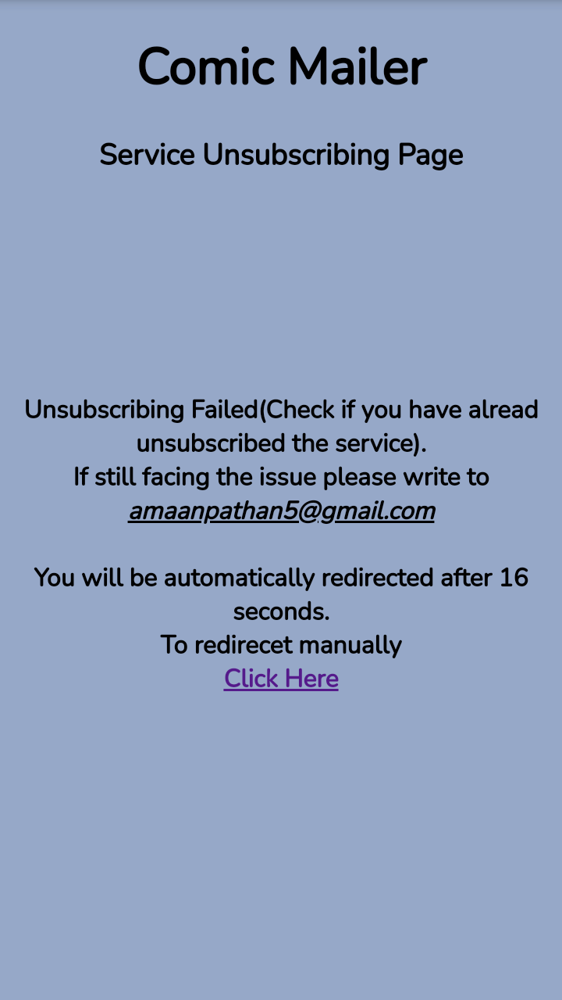
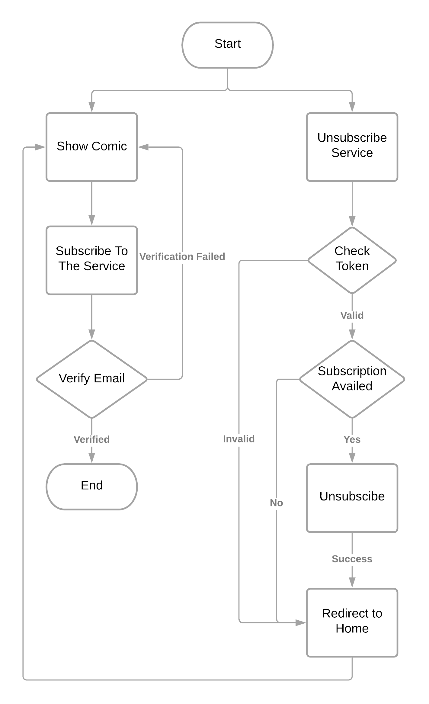

# Comic Mailer

- [Description](#description)
- [Directory Structure](#directory-structure)
- [Screenshots](#screenshots)
  - [Large Screen](#web-view)
  - [Mobile Screen](#mobile-view)
- [Technologies Used](#technologies-used)
- [Table Structures](#table-structure)
  - [Tables](#table)
  - [MySqls](#mysql)
- [Flow Diagram](#flow-diagram)
- [How To Run??](#how-to-run)
  - [For Windows](#for-windows)
    - [Pre-Requisites](#windows-pre-requisites)
    - [Steps](#windows-steps)
  - [For Linux](#for-linux)
    - [Pre-Requisites](#linux-pre-requisites)
    - [Steps](#linux-steps)


<a id="description"></a>
### Description
- **[Comic Mailer](https://comicmailer.herokuapp.com)** is a website on which a person can **read comic** on the go.
- **[Comic Mailer](https://comicmailer.herokuapp.com)** also provides the **service of comic mailing**.
    - In this service a random comic is sent through email at every 5 minutes interval with an unsubscribing link with the help of which user can unsubscribe the service.


<a id="directory-structure"></a>
### Directory Structure
- `root/base`
  - **[root/base directory](https://github.com/rtlearn/php-Pathan-Amaankhan)** contains the **home page's html, css and javascript** files along with **[app](https://github.com/rtlearn/php-Pathan-Amaankhan/tree/master/app)** and **[server](https://github.com/rtlearn/php-Pathan-Amaankhan/tree/master/server)** directory.
  
- `app`
  - **[app directory](https://github.com/rtlearn/php-Pathan-Amaankhan/tree/master/app)** contains all the **pages** as well as **assets** except the home page.
  - **Each page** contains its **own html, css and javascript** files.
  
- `server`
  - **[server directory](https://github.com/rtlearn/php-Pathan-Amaankhan/tree/master/server)** contains all the **php files and directories** required in the server.<br />The files and directories are:
    - **[apis](https://github.com/rtlearn/php-Pathan-Amaankhan/tree/master/server/apis)** *[Directory]*<br>
      1. **[apis directory](https://github.com/rtlearn/php-Pathan-Amaankhan/tree/master/server/apis)** contains all the **apis** which can be consumed by front-end.
    - **[classes](https://github.com/rtlearn/php-Pathan-Amaankhan/tree/master/server/classes)** *[Directory]*<br>
      1. **[classes directory](https://github.com/rtlearn/php-Pathan-Amaankhan/tree/master/server/classes)** contains all the **functional classes** which are used by various apis in apis directory.
    - **[cron.php](https://github.com/rtlearn/php-Pathan-Amaankhan/tree/master/server/cron.php)** *[File]*
      1. **[cron.php](https://github.com/rtlearn/php-Pathan-Amaankhan/tree/master/server/cron.php)** is cron-job which is used to **send email** after every **5 minute**. 
    - **[headers.php](https://github.com/rtlearn/php-Pathan-Amaankhan/tree/master/server/headers.php)** *[File]*
      1. **[headers.php](https://github.com/rtlearn/php-Pathan-Amaankhan/tree/master/server/headers.php)** file contains the headers which are consumed by apis.

<a id="screenshots"></a>
### Screenshots

<a id="web-view"></a>
- ##### Web View
|                  [Home Page](https://comicmailer.herokuapp.com)                        |                   [Unsubscribe Page](https://comicmailer.herokuapp.com/app/unsubscribe)               |
| :------------------------------------------------------------------------------------: | :---------------------------------------------------------------------------------------------------: |
|        |         |

<a id="mobile-view"></a>
- ##### Mobile View
|                  [Home Page](https://comicmailer.herokuapp.com)                        |                   [Unsubscribe Page](https://comicmailer.herokuapp.com/app/unsubscribe)               |
| :------------------------------------------------------------------------------------: | :---------------------------------------------------------------------------------------------------: |
|  |   |


<a id="technologies-used"></a>
### Technologies Used
:point_right: **[HTML](https://www.w3schools.com/html/)** <br />
:point_right: **[CSS](https://css-tricks.com/almanac/)** <br />
:point_right: **[JavaScript](https://developer.mozilla.org/en-US/docs/Web/JavaScript)** <br />
:point_right: **[PHP](https://www.w3schools.com/Php/)** <br />
:point_right: **[MySQL](https://www.w3schools.com/MySQL/)**


<a id="table-structure"></a>
### Table Structures

<a id="table"></a>
- ##### Tables
Users Table

|    Field   |     Type    |  Null |  Key  |      Default      |       Extra       |
| :--------: | :---------: | :---: | :---: | :---------------: | :---------------: |
|   email    | varchar(50) |  NO   |  PRI  |                   |                   |
|    time    |  timestamp  |  NO   |       | CURRENT_TIMESTAMP | DEFAULT_GENERATED |
|  last_otp  |    int(4)   |  NO   |       |                   |                   |
| subscribed |    int(1)   |  NO   |       |        0          |                   |
|   token    | varchar(50) |  YES  |       |                   |                   |

Cron Table

|     Field     |   Type  |  Null  |  Key  | Default |      Extra     |
| :-----------: | :-----: | :----: | :---: | :-----: | :------------: |
|      id       | int(10) |   NO   |  PRI  |         | auto_increment |
| cron_last_ran | int(50) |   No   |       |         |                |


<a id="mysql"></a>
- ##### MySql

Users Table

```mysql
CREATE TABLE users (
  email varchar(50) NOT NULL,
  time timestamp NOT NULL DEFAULT current_timestamp(),
  last_otp int(4) NOT NULL,
  subscribed int(1) NOT NULL DEFAULT 0,
  token varchar(50),
  PRIMARY KEY (email)
);
```

Cron Table
```mysql
CREATE TABLE cron_table (
  id int(10) NOT NULL AUTO_INCREMENT,
  cron_last_ran int(50) NOT NULL,
  PRIMARY KEY (id)
);
```

<a id="flow-diagram"></a>
### Flow Diagram


<a id="how-to-run"></a>
### How To Run??

<a id="for-windows"></a>
- ##### For Windows
  
  A Detailed guide for running PHP programs on **Windows** can be found [here](https://www.edureka.co/blog/how-to-run-a-php-program-in-xampp/).
  <a id="windows-pre-requisites"></a>
  - ###### Pre-Requisites
    - *[XAMPP](https://www.apachefriends.org/index.html)*
    - *[Text Editor](https://www.sublimetext.com/) / [IDE](https://www.jetbrains.com/help/phpstorm/installation-guide.html#standalone)*
    - *[SendGrid Account](https://sendgrid.com/)*
  

  <a id="windows-steps"></a>
  - ###### Steps
    1. Move the downloaded folder of Comic Mailer to **C:\xampp\htdocs**.
    2. Open [XAMPP](https://www.apachefriends.org/index.html) and start **Apache Server** and **MySql**.
    3. Click on the **Admin** to open php-MyAdmin.
    4. Create a table in php-MyAdmin using [command](#mysql) or [table structure](#table).
    5. Create an account on [SendGrid](https://sendgrid.com/) and generate the api.
    6. Replace the table and mail configurations in [class-constants.php](https://github.com/rtlearn/php-Pathan-Amaankhan/blob/master/classes/class-constants.php) file.
    7. Open the **localhost** on browser and open the **Comic Mailer** folder.

<a id="for-linux"></a>
- ##### For Linux
  
  A Detailed guide for running PHP programs on **Linux** can be found [here](https://www.techomoro.com/how-to-run-a-php-application-on-ubuntu-18-04-2-lts/).
  <a id="linux-pre-requisites"></a>
  - ###### Pre-Requisites
    - *[Apache2](https://www.liquidweb.com/kb/install-apache-2-ubuntu-18-04/)*
    - *[PHP](https://www.liquidweb.com/kb/install-apache-2-ubuntu-18-04/)*
    - *[phpMyAdmin](https://www.digitalocean.com/community/tutorials/how-to-install-and-secure-phpmyadmin-on-ubuntu-18-04)*
    - *[MySQL](https://www.digitalocean.com/community/tutorials/how-to-install-mysql-on-ubuntu-20-04)*
    - *[Text Editor](https://linuxize.com/post/how-to-install-sublime-text-3-on-ubuntu-20-04/) / [IDE](https://www.jetbrains.com/help/phpstorm/installation-guide.html#standalone)*
    - *[SendGrid Account](https://sendgrid.com/)*

  <a id="linux-steps"></a>
  - ###### Steps
    1. Move the downloaded folder of Comic Mailer to **/var/www/html**.
    2. Start Apache2 web server.git
    3. Create a table in php-MyAdmin using [command](#mysql) or [table structure](#table).
    4. Create an account on [SendGrid](https://sendgrid.com/) and generate the api.
    5. Replace the table and mail configurations in [class-constants.php](https://github.com/rtlearn/php-Pathan-Amaankhan/blob/master/classes/class-constants.php) file.
    6. Open the **localhost** on browser and open the **Comic Mailer** folder.